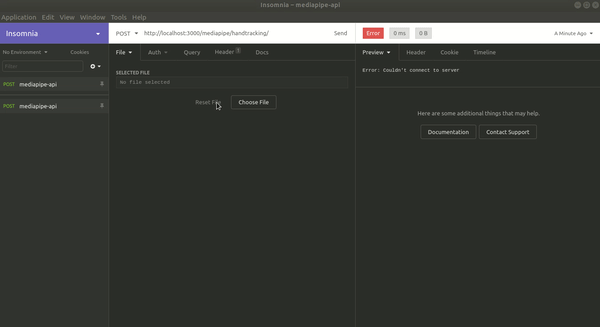

# Mediapipe API
The Mediapipe API is a RESTful API made in Flask to use the services offered by the [Mediapipe Framework](https://github.com/google/mediapipe/).

## Preparing Development Environment
Items in this checklist are required for the development environment:

### Local
1.  Download and install Python version 3.7+ and the Pip package manager. Follow the instructions (according to your operating system) on the  [official website](https://www.python.org/downloads/)  of the distributor.
2. Clone this repository.
3.  Create a Python  [virtual environment](https://virtualenv.pypa.io/en/stable/)  for the project using Virtualenv. This will cause project dependencies to be isolated from your Operating System. Once you create the python environment, enable it before proceeding to the next steps. Ex: You should see ``(env)your-user-name:$`` in the terminal. 
4. Run ``pip install -r requirements.txt`` to install dependencies.
5. If you want to run the application in a mode other than *production*, 2 others modes are available:
**Development**: will be running in 127.0.0.1:3000
**Production**: will be running in 127.0.0.1:8080
**Testing**: will be running in 127.0.0.1:8000
Right after choosing the mode, change with the name in **/src/app.py**. Please, check **/src/confi.py** for more info. **Production is chosen as default**.
7. Run ``python src/app.py`` to start app. Make **POST** request.

### Docker
1. [Install Docker](https://docs.docker.com/install/#supported-platforms) on your host system.
2. If you want to run the application in a mode other than *production*, 3 other modes are available: **Development, Testing** and **Default** (flask default). Please, check **/src/confi.py** for more info. Right after choosing the mode, change with the name in **/src/app.py**.
3.   Initialize the container by doing: ``docker-compose up``.
4. Start using it. Make **POST** request.

## How To Use
1. Choose your video to be processed and one of the services offered by the API: Hand Tracking, Multi Hand Tracking, Face Detection and Object Detection.
2. Open an application that tests rest request (Postman, Insomnia, etc) and make a **POST** request   
at the service endpoint with the video in the header (**video/mp4** as content type) and wait for the response:

## Notes
1. If you are not using Linux distribution, I recommend that you use Docker;
2. The request time is related to the size of the video you will send in the request, so it may take a little longer for heavy videos.
3. Use the **.mp4** format to avoid problems with Mediapipe
4. The tool used for requisition tests was the [Insomnia Rest](https://insomnia.rest/).
5. Only **POST** method is allowed.

## Reference
1. [MediaPipe Documentation](https://mediapipe.readthedocs.io/);
2. [Mediapipe GitHub](https://github.com/google/mediapipe/);